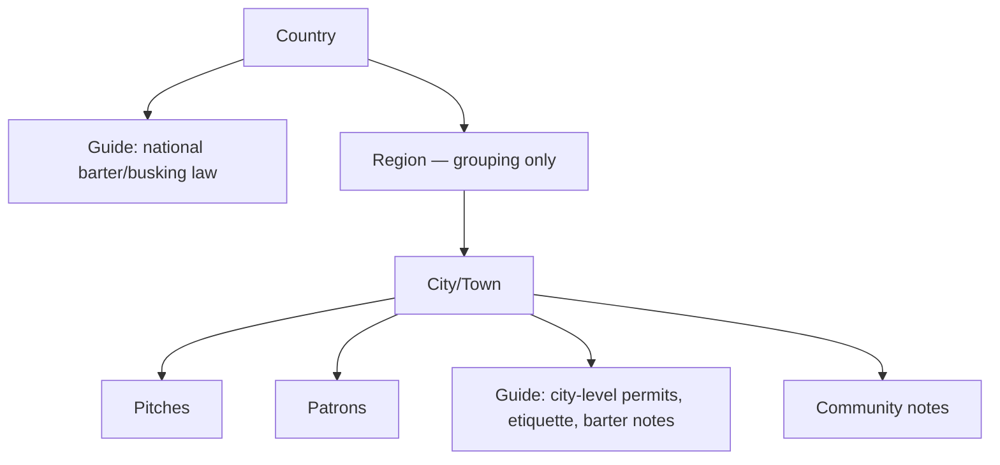

# Bed & Busk - Platform Overview

Last updated: 2026-09-21

**Bed & Busk — a barter platform for travelling artists.**

A peer-to-peer barter and gift-economy hospitality platform for traveling artists and buskers. Hosts are called patrons, guests are called artists. The platform stays deliberately at the barter/gift level - no cash gig marketplace, no live location tracking, no built-in payments - with those pieces left as possible future additions rather than core scope.

## Core Exchange Model — The Patron & Artist Engine

Four exchange types, all in-kind, none priced or negotiated as a transaction — an offer and an acceptance, not a rate card:

| Type | What's exchanged |
| --- | --- |
| Bed for Busk | A room/couch for a private mini-performance — house concert, portrait, fire show |
| Bed for Skill | A room/couch for a workshop, lesson, or help with a local project |
| Standard Stays | No-strings hospitality from patrons of the arts |
| Meal for Busk | A meal (restaurant, takeaway, or food truck) for a short performance during service — same barter logic as Bed for Busk, offered by a patron who runs a food business rather than (or alongside) a home |

Each patron and artist completes an **Offer/Expectation Profile** — a structured, one-time set of fields (space offered, duration comfort, house basics for patrons; craft/format, travel context, what's hoped for in return for artists) stated as ranges with a floor, not fixed asks ("a short performance, totally optional" vs. "would love a full house concert"). This stands in for the unwritten agreement that would otherwise only surface at the doorstep.

**Patron Profile vs. Listings** — a patron's Profile (identity, reviews, verification) is kept separate from one or more **Listings** hanging off it, each its own exchange type, dates, and terms. A patron offering a Bed for Busk slot in October and a Standard Stay the rest of the year posts two listings under one profile, rather than one profile trying to hold both at once. Artists apply to listings, not profiles.

**Icon tagging** — every patron is tagged with one or both of two non-exclusive icons, shown on their card and profile: a **bed** icon for any of the three lodging types (Bed for Busk, Bed for Skill, Standard Stay), and a **plate & cutlery** icon for Meal for Busk. A patron with both a spare room and a food stall carries both icons; there is no separate "Food & Drink" section splitting them off from the main Patrons list — Pitches remain the only separate, non-exchange category. Verification stays lighter for a Meal for Busk listing than for lodging: a business address and phone/email check is enough, since the exchange happens in a public venue during business hours rather than a private home overnight.

**Artist discipline tags** — artists carry the same kind of icon tagging as patrons, non-exclusive, shown on their card and profile: **music**, **circus skills**, **portraits/art**, **theatre**, **other**. An artist can carry more than one (a musician who also juggles shows both). This is what keeps "busking" honest as a broad term rather than a musicians-only one — the name stays Bed & Busk, but the tag set makes clear from the first glance at a profile that circus, visual art, and theatre performers are equally at home here, not just musicians.

**Availability** — each Listing carries a status: "Hosting now" or "Not currently hosting," plus a window when hosting (a date range, or "Open-ended"). Directories default to showing "Hosting now" patrons first; "Not currently hosting" patrons stay fully visible (profile, reviews, verification intact) under "All patrons" rather than disappearing. A patron with several Listings shows each one's own status separately rather than one blended line.

A patron updates this with a simple toggle, not a calendar tool: "I'm hosting" (start date, end date or open-ended) or "I'm not hosting right now" (the Listing goes inactive). On the Stage A pilot (GitHub Pages + Airtable), availability changes should trigger an immediate rebuild (via a GitHub Actions `repository_dispatch` webhook from the Airtable automation) rather than waiting for the next scheduled build — stale availability is the one kind of staleness that actually costs an artist a place to sleep.

## Experience Layer & Community Map

**Passerby & Fan Experiences** — artist-hosted invitations to join something (a workshop, a walk, behind-the-scenes), framed as an invitation rather than a service for sale.

**Community Map** — a static, crowd-sourced layer, not a live tracker:

- **Pitches**: known busking spots tagged with acoustics, foot traffic, best times, and whether the spot has been reported as friendly or hostile to performers
- **Reviews**: of the spot, and separately of patrons — closer to TripAdvisor/Airbnb host reviews than a live map

No real-time "who's performing where right now" — this removes stalking/targeting risk entirely rather than softening it, and a pitch's reputation outlives any single artist's visit.

## The Bed & Busk Guide

Open-edit, wiki-style, structured by location (see Website Outline below). Legal/regulatory content lives only at **City** and **Country** levels — no Region-level duplication; a devolved or regional rule is written directly into the relevant city's Guide.

Standard sections per city:

- **Pitches** — acoustics, foot traffic, best times, permit status
- **Permits & local rules** — noise ordinances, licensing, links to official sources (favor citing municipal pitch programs where they exist, e.g. Swansea's "From Busk Til Dawn")
- **Local etiquette** — non-obvious local norms
- **Community notes** — free-form artist tips
- **Barter/exchange notes** — kept distinct from busking permits: any local wrinkle in how in-kind lodging exchange is treated

Light moderation (recent-changes review, or a minimum review history before editing) rather than a dedicated maintainer per city.

## Trust, Safety & Verification

**Reviews** — two-way, mutually revealed after both sides submit; fixed tag vocabulary plus free text; reviews only count if tied to a confirmed match/stay.

**Abuse flagging** — kept separate from reviews: a private report to moderators, not a public review. Fixed categories (safety, harassment, property damage, no-show, other). No auto-penalty from a single flag; a threshold (2+ flags in a category) suspends new matches pending review.

**Verification — staged, not solved upfront:**

| Stage | Mechanism |
| --- | --- |
| 0 — Pilot cohort | No formal ID verification; social proof via linked portfolio/socials, manual vetting of first patrons |
| 1 | Email + phone verification as a floor for everyone |
| 2 | Optional third-party ID verification (Stripe Identity, Persona) as a badge, not a gate |
| 3 — Only if needed | Mandatory ID verification, triggered by scale or an incident |

Mirrors how Couchsurfing itself evolved — no verification at launch, layers added as it grew.

## Deferred for Later

Deliberately out of v1 scope — added only once the barter/gift architecture is proven:

- **Cash gig marketplace** ("Call for Performers" bulletin) — reintroduce as its own layer later if needed, kept separate from the hospitality core to avoid pulling the whole platform toward paid-booking framing
- **Tips/payments** — deferred; likely a partnership with an existing provider (e.g. Tackpay) rather than building a payment rail in-house

First get the architecture right, then see where a business model fits — the barter/gift core doesn't obviously need to monetize the exchange itself.

## Website Outline

Location is the foundational layer — every other object (patrons, pitches, Guide content, reviews) attaches to a City/Town node rather than existing as a flat global list. Region is an organizational grouping only, carrying no Guide content of its own.

| Page | Contains |
| --- | --- |
| Country | National Guide (barter legal status, general busking law framework) |
| Region | Browsing/grouping only — no Guide content |
| City/Town | Pitches, Patrons, city-level Guide, Community notes |
| Patron profile | Offer/Expectation Profile, reviews, verification badge |
| Artist profile | Offer/Expectation Profile, portfolio links, travel history (city stops), reviews, verification badge |
| Pitch page | Location, acoustics/foot-traffic notes, reviews |

This lets the platform ship city-by-city (seed one, get it dense, open the next) rather than needing a thin global layer everywhere at once, and gives each city a natural moderator cohort as its most active patrons/artists build review history there.

## Wireframes

Four key screens are mocked up on a shared canvas — City Hub (with a zoomed-out map of pitches), Patron Profile, Artist Profile, and Pitch Page, linked to each other for click-through review: [Bed & Busk — Wireframes](https://claude.ai/artifact/JRdiw5sbchCtanTQHVaQBr).

## MVP Scope

| Included | Deferred |
| --- | --- |
| Single pilot city (Bosa), Patron and Artist Offer/Expectation Profiles | Additional cities |
| Pitches and a static city map with pins | Interactive/live map |
| Two-way reviews (tags plus narrative) | Rich moderation tooling |
| Basic abuse-flag form | Threshold-based auto-suspension |
| City Guide as editable pages | Full open-edit wiki history |
| Email and phone signup, manual patron vetting (Stage 0/1 verification) | Optional ID verification badge (Stage 2) |
| — | Tips/payments, cash gig marketplace |

## Build Plan — Two Stages

### Stage A — Pilot Site (GitHub Pages + Airtable)

Launches fast with no custom backend, while Phase 0 patron recruitment is still manual:

- Two Airtable Forms (Patrons, Artists) collect submissions directly into the two intake tables, Status defaulting to "Prospect"
- An Airtable automation emails a notification on each new submission
- Manual review flips Status to "Active" once approved
- A GitHub Actions workflow pulls only Active rows from Airtable's API, on a schedule or manual trigger, and rebuilds the site with a static generator (Astro or 11ty) using the wireframes as page templates
- GitHub Pages serves the built site — free, custom domain supported, no server-side code

### Stage B — Full MVP (Cloudflare)

Built once live signup, matching requests, and reviews are actually needed:

| Piece | Cloudflare product |
| --- | --- |
| Frontend | Pages (or Workers static assets) |
| API/backend logic | Workers |
| Database | D1 — 10GB per database, ample for this schema |
| Photos | R2 — zero egress fees |
| Signup/bot protection | Turnstile |

Signup and login are custom logic against D1 (Cloudflare has no built-in public-user auth product); the city map needs a third-party tile layer (e.g. Leaflet + OpenStreetMap) regardless of host. The Airtable CSVs import directly into D1 as seed data when this stage begins — nothing from Stage A is thrown away.

## To-Do

- [ ] `patrons_template.csv` — add availability fields (status: Hosting now / Not currently hosting; start date; end date or open-ended) and split Listings out from the Profile row
- [ ] `patrons_template.csv` — add a Meal for Busk row/example, and an icon-tag field (bed / plate & cutlery / both)
- [ ] `artists_template.csv` — add a discipline-tag field (music / circus skills / portraits/art / theatre / other, non-exclusive)
- [x] Wireframes (`patron.html`, and the patron cards on `index.html`) — availability status pill and window shown, plus a fourth patron card demonstrating Meal for Busk
- [x] Wireframes (`patron.html`, and the patron cards on `index.html`) — bed / plate & cutlery icon tags added
- [x] Wireframes (`artist.html`) — discipline tag added (circus skills, for Jonas K.)
- [x] City Hub gallery — built and live: fetches real, licensed photos from Wikimedia at page load (via the place's own Wikipedia article images, to sidestep name-ambiguity issues), with per-image credit. Stage A's real build should run the same query once at build time instead of per visitor.
